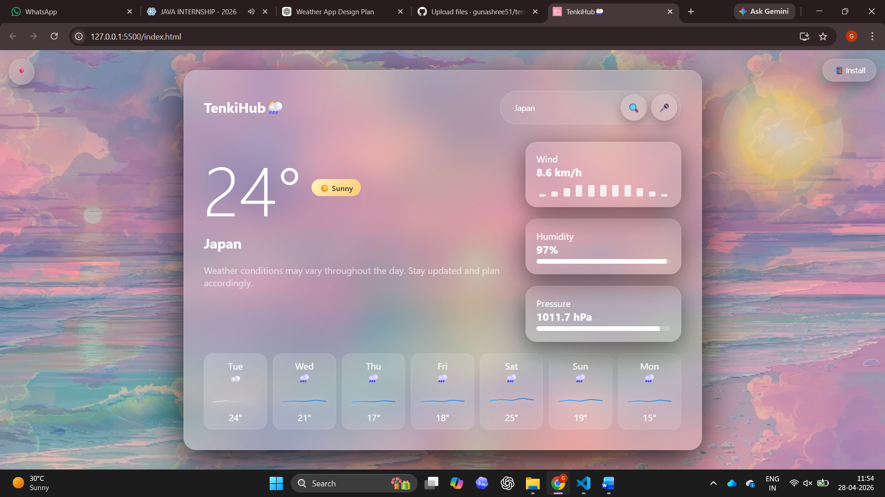
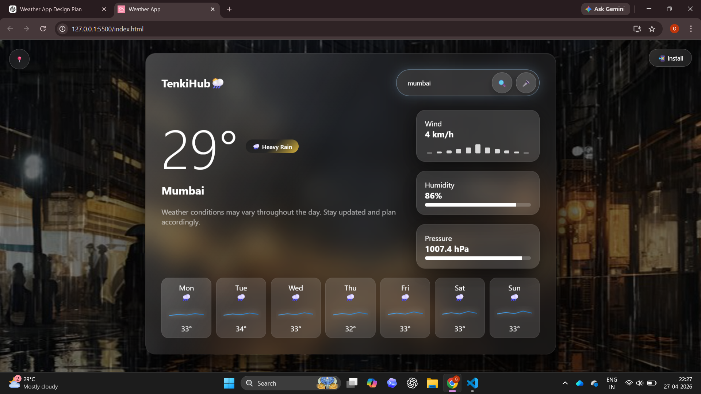
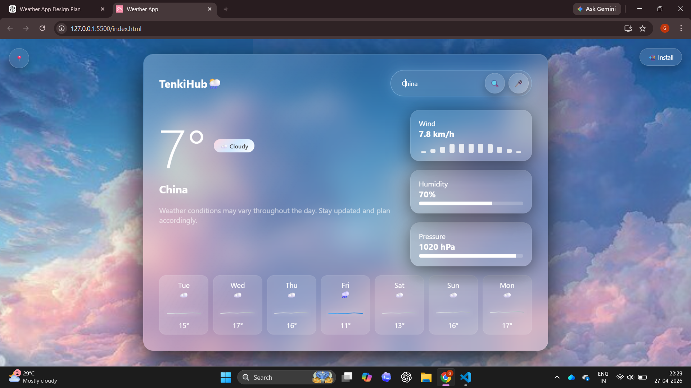

# 🌦️ TenkiHub — Smart Weather Experience

A modern, interactive weather web application built using JavaScript and Open-Meteo API, delivering real-time weather insights with a visually immersive and responsive UI.

---

## ✨ Features

- 🌍 Real-time weather data (temperature, humidity, pressure, wind)
- 📍 GPS-based location detection
- 🎤 Voice search for hands-free experience
- 🎨 Dynamic UI based on weather conditions (Sunny, Rainy, Cloudy, Thunder)
- 📊 Interactive data visualization (wind bars, humidity & pressure indicators)
- 📱 Fully responsive design (mobile + desktop)
- ⚡ Smooth animations & transitions
- 📲 Installable Progressive Web App (PWA) with offline support

---

## 🚀 Tech Stack

- HTML  
- CSS (Glassmorphism UI + Animations)  
- JavaScript (ES6+)  
- Open-Meteo API  

---

## 📸 Preview

### 🌤️ Weather Dashboard

### 🌧️ Dynamic Background & UI

### 📊 Data Visualization (Wind, Humidity, Pressure)

---

## 🌐 Live Demo

👉 

---

## 💡 Highlights

- Real-time API integration with dynamic UI updates  
- Smart UI transitions based on weather conditions  
- Clean and modern glass UI design  
- Optimized for performance and responsiveness  
- PWA-enabled for app-like experience  

---

## 📌 How It Works

1. Search for a city OR use GPS  
2. App fetches real-time weather data  
3. UI updates dynamically based on weather  
4. Visual indicators show key parameters  
5. Enjoy smooth, interactive experience  

---

## 👩‍💻 Author

**Gunashree S**

---

⭐ If you like this project, consider giving it a star!
